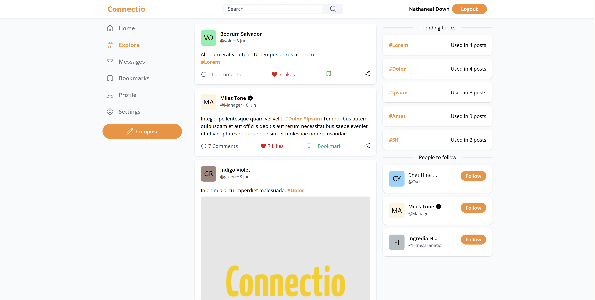

# Connectio
 Connectio is a social media that lets you follow people, post status updates, and share images with just a few taps. It also lets you interact with your followers in real-time, so you can get their feedback on your posts and ideas. With Connectio, you'll be able to keep track of everything happening in your social media world in one place.



## Technologies
The entire backend is built on the .NET Core platform using C#. The web app is built with the ASP.NET web framework and implements the MVC pattern. Views use TailwindCSS for styling. Security and account management are provided by the identity platform from Microsoft. Application stores all the data in relational SQL database and uses Entity Framework for mapping. SignalR pushes new notifications and messages to the user.

## List of features
* User account management - log in and register
* Share your thoughts by creating posts
* React with other posts by adding comments, likes, or bookmarks
* Interact with other people by following them
* Connect with other people by sending them a direct message
* Customize your profile by uploading profile and banner pictures
* Search for new users and posts
* Mark posts with specific topics by adding tags

## Get started
Generate connection string either from SSMS local one or get a hosted one and update `appsettings.json`
```JSON
"ConnectionStrings": {
	"ConnectioDbContextConnection": "{{ connection string }}"
}
```
Update database though EF Tools - can be done via `.NET CLI` or `Microsoft.EntityFrameworkCore.Tools` from NuGet packages. Depending on tool run, this will update Db to the latest migration
```
Update-Database
```
Run the application, first start will populate the Db with some dummy data from `/Data/DbInitializer.cs` or can be prevented be removing `await DbInitializer.Seed(app);` from `Program.cs`. All users use same password and @handle to log in e.i.
```
username: green
password: password
```

## Notice
The goal of this application is to learn about new technologies. I would highly advise against the use in production.